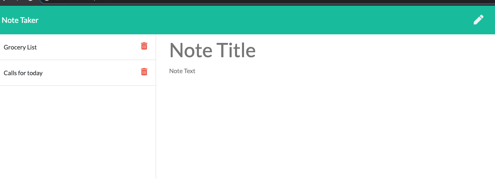

# Express-Note-Taker

## Objective 
This is an application that can be used to write, save, and delete notes by using Express.js.

## Usage 
Creating notes for a todo list that dynamically populate and list. When done, the user can hit delete and get rid of the notes.

## Screenshots

Note Taker Preview:

## Technology

- JavaScript
- CSS/HTML
- Express.js
- Node.js